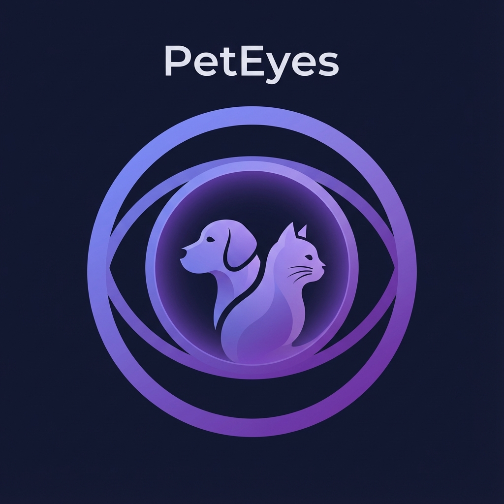

# 👁️ PetEyes

**See the world through your pet's eyes**

PetEyes is a Progressive Web App (PWA) that lets you experience how dogs and cats perceive colors in real-time using your device's camera.



## 🌟 Features

- **Real-time Camera Filters**: Apply scientifically-based color vision filters
- **Dog Vision**: Simulates dichromatic vision (blue-yellow spectrum)
- **Cat Vision**: Similar to dogs but with enhanced brightness (night vision)
- **PWA Support**: Install on your iPhone/Android home screen like a native app
- **Offline Ready**: Service worker caching for offline functionality
- **Beautiful UI**: Modern, premium design with smooth animations

## 🧬 How It Works

### Dog Vision
Dogs are dichromats - they have only two types of color receptors (compared to humans' three). They see:
- Blues and yellows clearly
- Reds appear yellowish-brown
- Greens appear yellow
- Overall less vibrant colors

### Cat Vision  
Cats have similar dichromatic vision to dogs but with some differences:
- Slightly better color discrimination than dogs
- Enhanced brightness perception (better night vision)
- Blues and yellows are distinguishable
- Reds and greens are muted

## 📱 Installation

### On iPhone:
1. Open the app in Safari
2. Tap the Share button
3. Select "Add to Home Screen"
4. Tap "Add"

### On Android:
1. Open the app in Chrome
2. Tap the menu (three dots)
3. Select "Add to Home screen"
4. Tap "Add"

## 🚀 Development

### Prerequisites
- Modern web browser with camera support
- HTTPS connection (required for camera access)

### Local Development
```bash
# Clone the repository
git clone https://github.com/ealfaro29/peteyes.git
cd peteyes

# Serve locally (requires HTTPS for camera)
# Option 1: Using Python
python3 -m http.server 8000

# Option 2: Using Node.js http-server
npx http-server -p 8000

# Option 3: Using PHP
php -S localhost:8000
```

Note: For camera access to work locally, you may need to use HTTPS. Consider using `ngrok` or similar tools for local HTTPS.

## 🛠️ Tech Stack

- **HTML5**: Semantic structure
- **CSS3**: Modern design with CSS variables, gradients, and animations
- **Vanilla JavaScript**: No frameworks - pure ES6+
- **Canvas API**: Real-time image processing
- **MediaDevices API**: Camera access
- **Service Workers**: Offline functionality
- **Web App Manifest**: PWA installation

## 📂 Project Structure

```
peteyes/
├── index.html          # Main HTML structure
├── styles.css          # Complete styling with design system
├── app.js              # Core application logic
├── manifest.json       # PWA manifest
├── sw.js               # Service worker
├── icons/              # App icons
│   ├── icon-192.png
│   └── icon-512.png
└── README.md           # Documentation
```

## 🎨 Design System

The app uses a carefully crafted design system with:
- **Color Palette**: Purple gradients, dark backgrounds
- **Typography**: Inter font family
- **Spacing**: Consistent 8px grid
- **Animations**: Smooth transitions and micro-interactions
- **Responsive**: Mobile-first design

## 🔒 Privacy

- No data is collected or stored
- Camera feed is processed locally in real-time
- No images are saved or transmitted
- No analytics or tracking

## 🐛 Known Limitations

- Camera access requires HTTPS (except localhost)
- Some mobile browsers may have different camera APIs
- Color filters are approximations based on scientific research
- Actual pet vision varies by individual animal

## 📚 Scientific References

The color filters are based on research about animal vision:
- Dogs and cats are dichromats (2 color receptors vs humans' 3)
- They lack red cones, making red-green discrimination difficult
- Enhanced rod density provides better night vision

## 🤝 Contributing

Contributions are welcome! Feel free to:
- Report bugs
- Suggest features
- Submit pull requests

## 📄 License

This project is licensed under the MIT License - see the LICENSE file for details.

## 👨‍💻 Author

**Esteban Alfaro**
- GitHub: [@ealfaro29](https://github.com/ealfaro29)

## 🙏 Acknowledgments

- Color vision research from veterinary science studies
- PWA best practices from web.dev
- Design inspiration from modern mobile apps

---

Made with ❤️ for pet lovers everywhere
